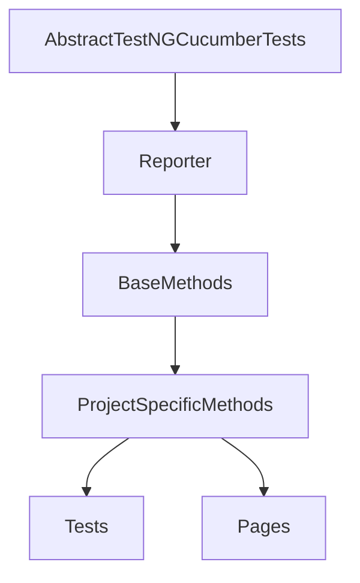

# UI Automation Framework
## Table Of Contents
- Project Description
- Tech Stack
- Setup
- Framework Design
- Execution flow
- Features
- Enhancements

### Project Description
Creation of UI Automation framework to automate the Hudl login page.

### Tech Stack 
- Selenium WebDriver is used to interact with the Web applications.
- Java language is used to write the scripts.
- TestNG is used for test execution.
- Cucumber is used to support the BDD automation.
- Extent reports are used to display the reports.

### Setup
- Download and install Java from official oracle site or java site using the [link](https://www.oracle.com/uk/java/technologies/downloads/). 
- Set the environment variables and path for Java (Refer link - https://www.qamadness.com/knowledge-base/how-to-install-maven-and-configure-environment-variables/ )
- Download maven from official apache site (https://maven.apache.org/download.cgi) and set the environmenet variables and path for Maven in your machine. ( Refer Link - https://www.qamadness.com/knowledge-base/how-to-install-maven-and-configure-environment-variables/)
- Using command line run commands java -version and mvn -version to confirm the java and maven availability in your machine.
- Download Eclipse 64 bit and place it in a new folder in the local drive.
- Create a new Maven project in eclipse and add the below dependencies in the pom.xml file
```
 <dependency>
	<groupId>com.aventstack</groupId>
	<artifactId>extentreports</artifactId>
	<version>3.1.5</version>
 </dependency>
 <dependency>
	<groupId>org.seleniumhq.selenium</groupId>
	<artifactId>selenium-java</artifactId>
	<version>4.0.0</version>
 </dependency>
 <dependency>
 	<groupId>org.testng</groupId>
	<artifactId>testng</artifactId>
	<version>7.4.0</version>
 </dependency>
 <dependency>
 	<groupId>io.github.bonigarcia</groupId>
	<artifactId>webdrivermanager</artifactId>
	<version>4.2.2</version>
 </dependency>
 <dependency>
 	<groupId>commons-io</groupId>
	<artifactId>commons-io</artifactId>
	<version>2.8.0</version>
 </dependency>
 <dependency>
 	<groupId>io.cucumber</groupId>
	<artifactId>cucumber-testng</artifactId>
	<version>6.10.0</version>
 </dependency>
 <dependency>
 	<groupId>io.cucumber</groupId>
	<artifactId>cucumber-java</artifactId>
	<version>6.10.0</version>
 </dependency>
```

### Framework Design
- The Browser Actions and DOM Elements actions are created as interfaces, which is implemented in the BaseMethods which acts as library for Wrapper methods.
- The ProjectSepecificMethods acts as the Base class which has common methods specific to the project like the entry and exit of the application.
- This framework is designed based on the Page Object model pattern, where each page is implemeted in a class using Java.
- The Utility package has the classes related to external applications (Reporter)
- It follows the BDD approach using Cucumber, where Feature files are created and called by the step definition classes (page class).
- The testcases are called from the tests class (Runner class) where the features and the step definitions are mapped.
- The execution is done through the TestNG.xml where the tests classes are called. 


### Execution Flow
```
@BeforeSuite --> Reporter (beginReport)
	@BeforeTest --> Tests_class (setValues)
		@BeforeClass --> Reporter (report)
				@BeforeMethod --> ProjectSpecificMethods (initiateApp)
					The tests_class is executed that is available in the testNg.xml (Tests_LoginModule)
				@AfterMethod --> ProjectSpecificMethods (closeApp)
		@AfterClass --> No Method
	@AfterTest --> No Method
@AfterSuite	--> Reporter (endReport)
```
- **Steps to run** 
  - System should have compatible java and MVN versions to run the scripts.
  - Download and copy the code from git to the local directory.
  - Open the command line from the project path where the pom.xml file is available.
  - Run the command `mvn install test` for 1st time run and there after we can run using command `mvn test`
  - Reports will be saved in the path <ProjectName>/reports/results.html which can be viewed through the system editor and screenshots will be placed in <ProjectName>/reports/images folder

### Features
- **Login Feature**
	- To validate the login page of Hudl.com with valid credentials
	- To validate if the links such as Sign_Up , Need_help are accessible from the login page.
	- Negative Test - To validate the login page of Hudl with invalid credentials

### Enhancements
- This framework can be extended to perform the validation of all the pages in the Hudl.com application
- This framework can be extended to use the mail verfication for functionalities such as Sign_in and Reset_Password using Mailinatour dependencies.
- This framework can be extended to obtain data from excel sheets using the Apachi_POI dependencies.
- This framework can also be extended to perform API testing through Karate or Rest assured libraries.

**Note**
- The wider team is using Selenium with BDD, POM hence have used the same. But the language used is Java because of ease of standartisation , libraries and verbosity.
